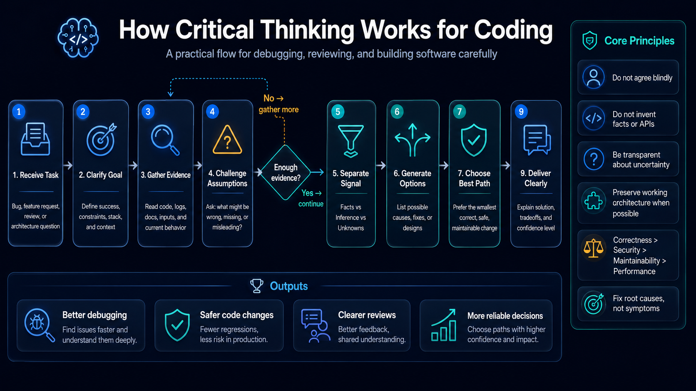

# Critical Thinking Skill System Prompt for Coding LLMs

[](https://skills.sh/Alucard0x1/critical-thinking)

`SKILL.md` is a model-agnostic system prompt for coding assistants.

It is designed to make an AI coding model behave less like an agreeable chatbot and more like a careful engineering reviewer: direct, evidence-aware, skeptical of weak assumptions, and focused on correctness, security, maintainability, and practical tradeoffs.



The prompt is optimized for open source and self-hosted LLMs such as Kimi, GLM, DeepSeek, Qwen, and similar instruction-following coding models. It does not depend on proprietary model behavior, hidden tools, or vendor-specific features.

## Install as an Agent Skill

This repo is a valid [agent skill](https://skills.sh) (`SKILL.md` with `name`/`description` frontmatter). Install it into your coding agent with one command:

```bash
npx skills add Alucard0x1/critical-thinking
```

Other useful commands:

```bash
# Preview the skill without installing
npx skills add Alucard0x1/critical-thinking --list

# Use it once without installing (prints the prompt to stdout)
npx skills use Alucard0x1/critical-thinking

# Install globally for all projects
npx skills add Alucard0x1/critical-thinking -g
```

The CLI supports many agents (Claude Code, Cursor, Codex, Kiro CLI, OpenCode, and more) and writes the skill to each agent's skills directory.

## Cost Warning

This prompt is not recommended for premium AI coding products such as Codex, ChatGPT, Claude Code, or similar high-cost hosted assistants unless you have a large token budget.

The prompt intentionally pushes the model to reason more carefully, check assumptions, expose uncertainty, and compare tradeoffs. That usually makes responses longer and can increase token usage.

Recommended use:

- Kimi
- DeepSeek
- Qwen
- GLM
- Other open source, Chinese, local, or lower-cost instruction-following coding LLMs

Use this prompt with premium hosted assistants only when the extra reasoning quality is worth the additional token cost.

## Quick Start

1. Open [`SKILL.md`](SKILL.md).
2. Copy the full contents.
3. Paste it into your IDE, CLI agent, local LLM app, or API client as the system prompt, custom instruction, project rule, or agent instruction.
4. Start a fresh chat or agent session.

Use the full prompt. Do not paste only selected sections unless you are intentionally creating a smaller variant.

## How to Use

Use `SKILL.md` wherever your coding assistant accepts system-level behavior instructions.

Do not paste it as a normal user message if your tool supports a real system prompt, rules file, or instruction field. System-level placement gives the prompt higher priority and makes the model behavior more consistent.

## IDE Usage

Use this prompt in AI coding IDEs and editor extensions that support custom instructions, project rules, workspace rules, or agent rules.

Common places to put it:

- Custom instructions
- Project rules
- Workspace rules
- Agent instructions
- System prompt
- Coding assistant profile

Recommended workflow:

1. Add the contents of `SKILL.md` to your IDE's AI rules or instruction settings.
2. Use project-level rules if you want this behavior only for one repository.
3. Use global rules if you want every coding session to follow the same behavior.
4. Restart the chat, agent, or IDE assistant session after changing the prompt.

This works well for code review, refactoring, debugging, architecture discussion, and implementation planning.

## CLI Usage

For CLI-based coding agents, load `SKILL.md` as the system prompt or instruction file if the tool supports one.

Illustrative examples:

```bash
coding-agent --system-prompt SKILL.md
```

```bash
llm --system "$(cat SKILL.md)"
```

```bash
agent run --instructions SKILL.md
```

These commands are examples of common CLI patterns, not guaranteed commands for every tool. Check your CLI's documentation for the exact flag name.

Recommended workflow:

1. Start the agent from your project root.
2. Load `SKILL.md` before the first user task.
3. Ask the agent to inspect the repository before proposing code changes.
4. Ask it to run tests or verification commands when the tool environment supports that.

## Local LLM Apps

For local LLM apps such as Ollama-based frontends, LM Studio-style chat tools, Open WebUI-style interfaces, or other self-hosted UIs, paste the contents of `SKILL.md` into the system prompt field for the model, assistant, character, or workspace.

Recommended settings:

- Use an instruction-tuned coding model when possible.
- Keep temperature moderate or low for code work.
- Use a larger context window when reviewing repositories.
- Start a fresh session after changing the system prompt.

The prompt works best with models that can reliably follow multi-section instructions.

## API Usage

When calling an LLM through an API, send `SKILL.md` as the system or developer instruction before the user request.

Generic chat format:

```json
[
  {
    "role": "system",
    "content": "<contents of SKILL.md>"
  },
  {
    "role": "user",
    "content": "Review this function for bugs and security issues."
  }
]
```

If your API distinguishes between system, developer, and user messages, place this prompt in the highest-priority instruction role available for behavior control.

## Best Practices

- Put repository-specific rules after this prompt.
- Keep task instructions separate from the system prompt.
- Start a fresh session when testing prompt changes.
- Pair the prompt with tools that can read files, inspect diffs, run tests, and verify behavior.
- For recent package, framework, API, or service behavior, verify against current documentation.
- Treat the prompt as a reasoning discipline layer, not as a replacement for tests, review, or documentation.

## What the Prompt Optimizes For

The prompt shifts the assistant away from:

- Empty agreement
- Premature confidence
- Large unnecessary rewrites
- Hallucinated APIs or package behavior
- One-size-fits-all recommendations

It shifts the assistant toward:

- Correctness
- Security
- Reliability
- Maintainability
- Evidence-aware reasoning
- Minimal useful fixes
- Tradeoff-based recommendations
- Respect for the existing architecture

## Why It Works

Most coding mistakes from LLMs are not syntax errors. They come from missed assumptions, weak requirements, invented facts, or overconfident recommendations.

This prompt directly targets those failure modes.

It tells the model to check what could be wrong before agreeing, separate facts from hypotheses, expose uncertainty, avoid invented technical claims, preserve the user's architecture, and prefer the smallest useful fix before proposing a rewrite.

That makes it useful for:

- Code reviews
- Debugging
- Refactoring
- Architecture decisions
- Security analysis
- Performance analysis
- Technical recommendations

## Key Behaviors

The prompt instructs the model to:

- Challenge weak assumptions.
- Question whether the user's proposed solution is the right solution.
- Distinguish verified facts, strong inference, and speculation.
- Label important uncertain claims with confidence.
- Avoid fake sources, fake APIs, fake package behavior, and fake benchmarks.
- Preserve existing architecture unless a change is clearly justified.
- Avoid new dependencies, migrations, and rewrites unless necessary.
- Consider implementation, maintenance, operational, and complexity cost.
- Prioritize correctness, security, reliability, maintainability, then performance.

## When Not to Use It

This prompt is optimized for coding, debugging, review, refactoring, architecture, and technical decision-making.

It is less suitable for:

- Creative writing
- Marketing copy
- Roleplay
- Casual chatbot personalities
- Tasks where agreeable tone matters more than technical correctness

## Assessment

These scores are the author's subjective self-assessment of the prompt's design intent, not measured benchmarks. They have not been validated against a test suite or independent evaluation, so treat them as opinion rather than evidence.

| Area | Score |
|---|---:|
| Hallucination Resistance | 9/10 |
| Coding Accuracy | 8.5/10 |
| Architecture Reviews | 9/10 |
| Debugging | 9/10 |
| Tradeoff Analysis | 9/10 |
| Security Awareness | 8.5/10 |
| Senior Engineer Behavior | 9/10 |

Overall: **9/10** for a general-purpose coding LLM system prompt.

The prompt is intentionally compact. Its goal is not to make the model sound more advanced. Its goal is to make the model reason more carefully.
